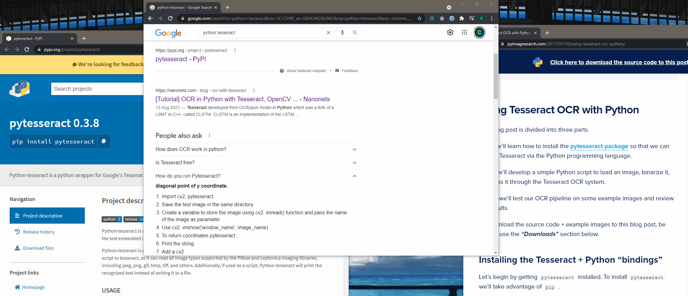

# FindText
Search for any text on your screen (including in images and videos) using Google's Tesseract OCR Engine.  
Optionally press the key that displays next to the result to click on it.

> Note: searching only begins after pressing enter. It may take several seconds to complete.

## Example usage:
`ft pytesseract`

### Post v1.1.0
`ft Themes`  

## Requirements
Python packages:
* opencv-python
* Pillow
* pytesseract
* numpy
* pyautogui

Other:
* Follow the install instructions for `pytesseract` [here](https://pypi.org/project/pytesseract/#installation)